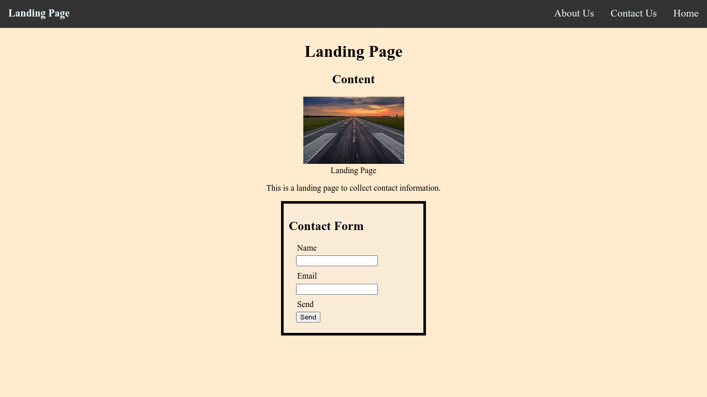

# Bootcamp Mini Project 1 - Landing Page

## Description 

This project was created using HTML and CSS to make a landing page without starting code. There was the following requirements 

For this project, a webpage was editted to meet accessibility standards. This was achieved by completing the following:

* Create a single webpage that collects a visitor's contact information.
* The page needs to have a header and footer.
* The page needs to have an image with a caption.
* The page to have a contact form.
* The page uses semantic HTML elements.
* The page uses universal, element, and class selectors in CSS.
* The page features at least three colors in the design.
* Rhe page uses a single font and font family for all text.
* The page uses at least two heading elements (`<h1>` through `<h6>`).
* The header is fixed to the top of the page on scroll.
* The header contains a navigation bar with three links that display inline, including a contact link.
* The contact link is clicked, the page jumps directly to the contact form.
* The contact form includes `input` elements for name and email.
* The contact form includes a Send button.
* The image includes a descriptive `alt` attribute.
* The page is deployed to GitHub Pages.

The following page is the result.

## Installation

The site does not require installation steps.

## Usage 

The website can be viewed at [https://bowseruk.github.io/bootcamp-mini-project1/](https://bowseruk.github.io/bootcamp-mini-project1/) with Google Chrome. The source can be viewed in Chrome by right clicking and selecting inspect.

## Credits

This site was based on a project by edX Boot Camps LLC.

[W3School](https://www.w3schools.com/) was used as a reference for elements to use and good practice.

The changes were checked with [W3C Validator](https://validator.w3.org/).

## License

This project uses the licence in the LICENCE file of the repo.
